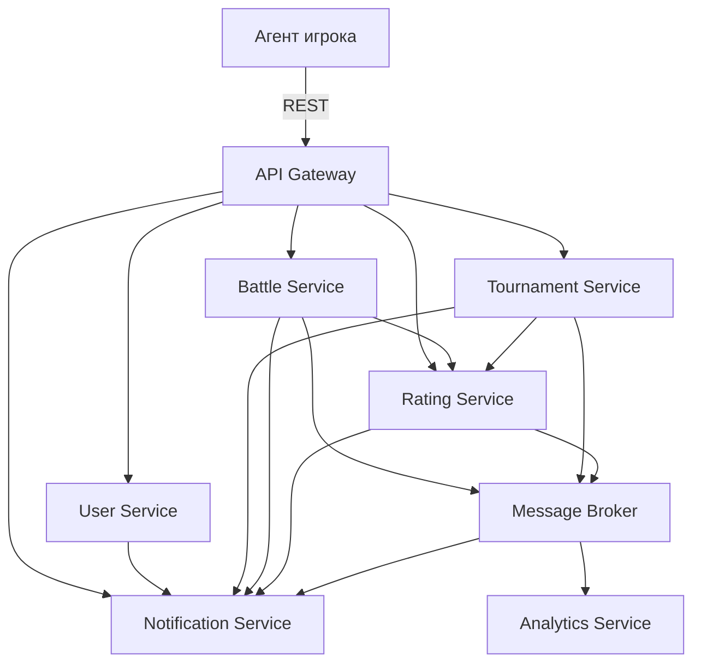

>Общая архитектура игры Космический бой:
>>   Компоненты:
>   - Агент игрока (Game Client) – запускает игру и взаимодействует с сервером боев.
>   - API Gateway – центральная точка для внешних запросов и маршрутизации к микросервисам.
>   - Сервис пользователей (User Service) – регистрация, аутентификация, профиль.
>   - Сервис турниров (Tournament Service) – создание турниров, заявки, расписание, рейтинги.
>   - Сервис боев (Battle Service) – проведение боев, запись результатов.
>   - Сервис уведомлений (Notification Service) – push/email уведомления.
>   - Сервис рейтингов (Rating Service) – расчёт рейтинга игроков и турниров.
>   - Сервис логирования/аналитики (Analytics Service) – хранение статистики и метрик.
>   - Брокер сообщений (Message Broker) – Kafka для событий между сервисами.
