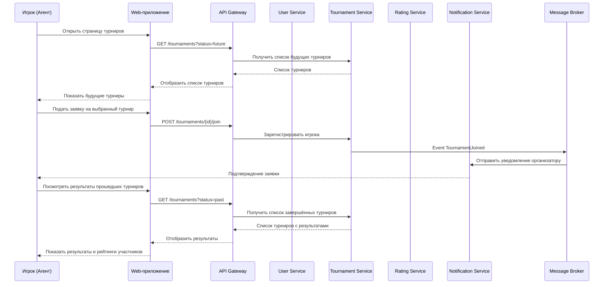

## Сценарий: 
### Игрок хочет:
> - Посмотреть список будущих турниров
> - Подать заявку на участие
> - Посмотреть результаты уже прошедших турниров

```mermaid
sequenceDiagram
    participant Player as Игрок (Агент)
    participant Web as Web-приложение
    participant API as API Gateway
    participant US as User Service
    participant TS as Tournament Service
    participant RS as Rating Service
    participant NS as Notification Service
    participant MB as Message Broker

    %% Шаг 1: Просмотр будущих турниров
    Player->>Web: Открыть страницу турниров
    Web->>API: GET /tournaments?status=future
    API->>TS: Получить список будущих турниров
    TS-->>API: Список турниров
    API-->>Web: Отобразить список турниров
    Web-->>Player: Показать будущие турниры

    %% Шаг 2: Подать заявку на турнир
    Player->>Web: Подать заявку на выбранный турнир
    Web->>API: POST /tournaments/{id}/join
    API->>TS: Зарегистрировать игрока
    TS->>MB: Event TournamentJoined
    MB->>NS: Отправить уведомление организатору
    NS-->>Player: Подтверждение заявки

    %% Шаг 3: Просмотр результатов прошедших турниров
    Player->>Web: Посмотреть результаты прошедших турниров
    Web->>API: GET /tournaments?status=past
    API->>TS: Получить список завершённых турниров
    TS-->>API: Список турниров с результатами
    API-->>Web: Отобразить результаты
    Web-->>Player: Показать результаты и рейтинги участников
```