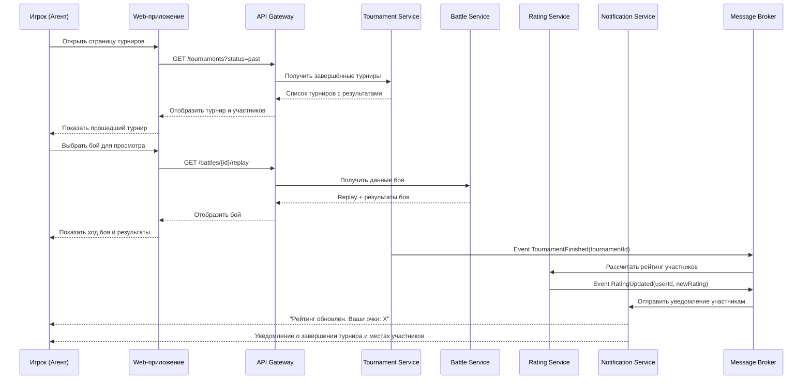

### Полный сценарий последовательности для игрока, включающий:

> - Просмотр прошедших боев
> - Начисление рейтинговых очков за места в турнире
> - Получение уведомлений о результатах

```mermaid
sequenceDiagram
    participant Player as Игрок (Агент)
    participant Web as Web-приложение
    participant API as API Gateway
    participant TS as Tournament Service
    participant BS as Battle Service
    participant RS as Rating Service
    participant NS as Notification Service
    participant MB as Message Broker

%% 1. Игрок просматривает прошедший турнир
    Player->>Web: Открыть страницу турниров
    Web->>API: GET /tournaments?status=past
    API->>TS: Получить завершённые турниры
    TS-->>API: Список турниров с результатами
    API-->>Web: Отобразить турнир и участников
    Web-->>Player: Показать прошедший турнир

%% 2. Просмотр прошедшего боя
    Player->>Web: Выбрать бой для просмотра
    Web->>API: GET /battles/{id}/replay
    API->>BS: Получить данные боя
    BS-->>API: Replay + результаты боя
    API-->>Web: Отобразить бой
    Web-->>Player: Показать ход боя и результаты

%% 3. Завершение турнира и начисление рейтинга
    TS->>MB: Event TournamentFinished(tournamentId)
    MB->>RS: Рассчитать рейтинг участников
    RS->>MB: Event RatingUpdated(userId, newRating)
    MB->>NS: Отправить уведомление участникам
    NS-->>Player: "Рейтинг обновлён. Ваши очки: X"

%% 4. Уведомления
    NS-->>Player: Уведомление о завершении турнира и местах участников
```