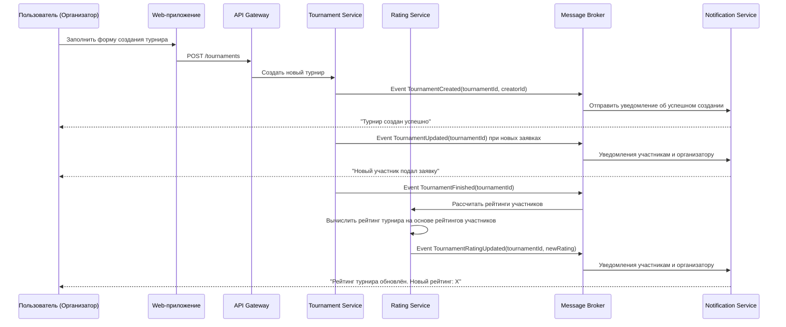

```mermaid
sequenceDiagram
participant User as Пользователь (Организатор)
participant Web as Web-приложение
participant API as API Gateway
participant TS as Tournament Service
participant RS as Rating Service
participant MB as Message Broker
participant NS as Notification Service

    %% 1. Пользователь создаёт турнир
    User->>Web: Заполнить форму создания турнира
    Web->>API: POST /tournaments
    API->>TS: Создать новый турнир
    TS->>MB: Event TournamentCreated(tournamentId, creatorId)
    MB->>NS: Отправить уведомление об успешном создании
    NS-->>User: "Турнир создан успешно"

    %% 2. Участники подают заявки
    TS->>MB: Event TournamentUpdated(tournamentId) при новых заявках
    MB->>NS: Уведомления участникам и организатору
    NS-->>User: "Новый участник подал заявку"

    %% 3. Турнир завершён, начисление рейтинга турнира
    TS->>MB: Event TournamentFinished(tournamentId)
    MB->>RS: Рассчитать рейтинги участников
    RS->>RS: Вычислить рейтинг турнира на основе рейтингов участников
    RS->>MB: Event TournamentRatingUpdated(tournamentId, newRating)
    MB->>NS: Уведомления участникам и организатору
    NS-->>User: "Рейтинг турнира обновлён. Новый рейтинг: X"
```