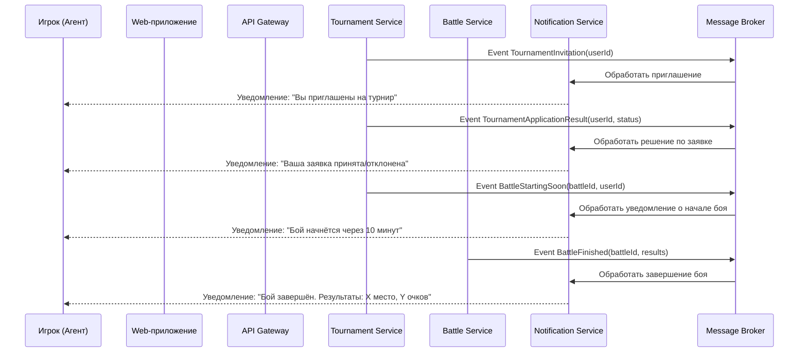

## Сценарий: 
### Игрок получает уведомления о:
> - Приглашении на турнир
> - Решении по заявке на участие
> - Скором начале боя
> - Завершении боя

```mermaid
sequenceDiagram
    participant Player as Игрок (Агент)
    participant Web as Web-приложение
    participant API as API Gateway
    participant TS as Tournament Service
    participant BS as Battle Service
    participant NS as Notification Service
    participant MB as Message Broker

    %% 1. Приглашение на турнир
    TS->>MB: Event TournamentInvitation(userId)
    MB->>NS: Обработать приглашение
    NS-->>Player: Уведомление: "Вы приглашены на турнир"

    %% 2. Решение по заявке
    TS->>MB: Event TournamentApplicationResult(userId, status)
    MB->>NS: Обработать решение по заявке
    NS-->>Player: Уведомление: "Ваша заявка принята/отклонена"

    %% 3. Скорое начало боя
    TS->>MB: Event BattleStartingSoon(battleId, userId)
    MB->>NS: Обработать уведомление о начале боя
    NS-->>Player: Уведомление: "Бой начнётся через 10 минут"

    %% 4. Завершение боя
    BS->>MB: Event BattleFinished(battleId, results)
    MB->>NS: Обработать завершение боя
    NS-->>Player: Уведомление: "Бой завершён. Результаты: X место, Y очков"
```